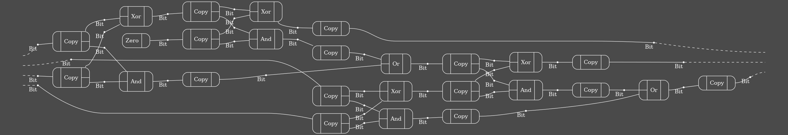

# Open Hypergraphs Dot

A Rust library for visualizing
lax [open hypergraphs](https://crates.io/crates/open-hypergraphs)
using the GraphViz DOT format.

## Examples

Run the `adder` example:

    cargo run --example adder

This will produce the following depiction of an open hypergraph representing a
2-bit ripple-carry adder:

See [./examples/adder.rs](./examples/adder.rs) for the source code producing this example.
